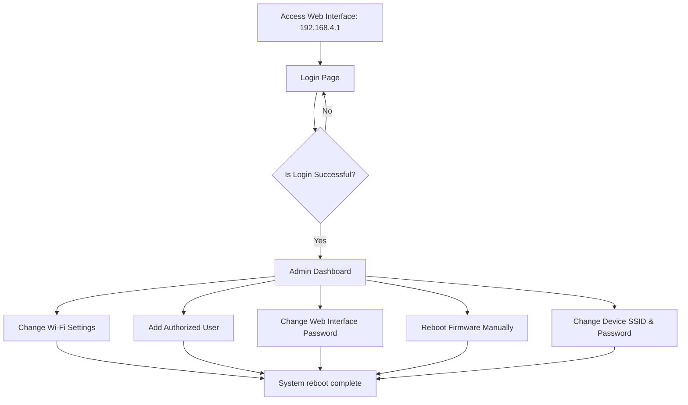
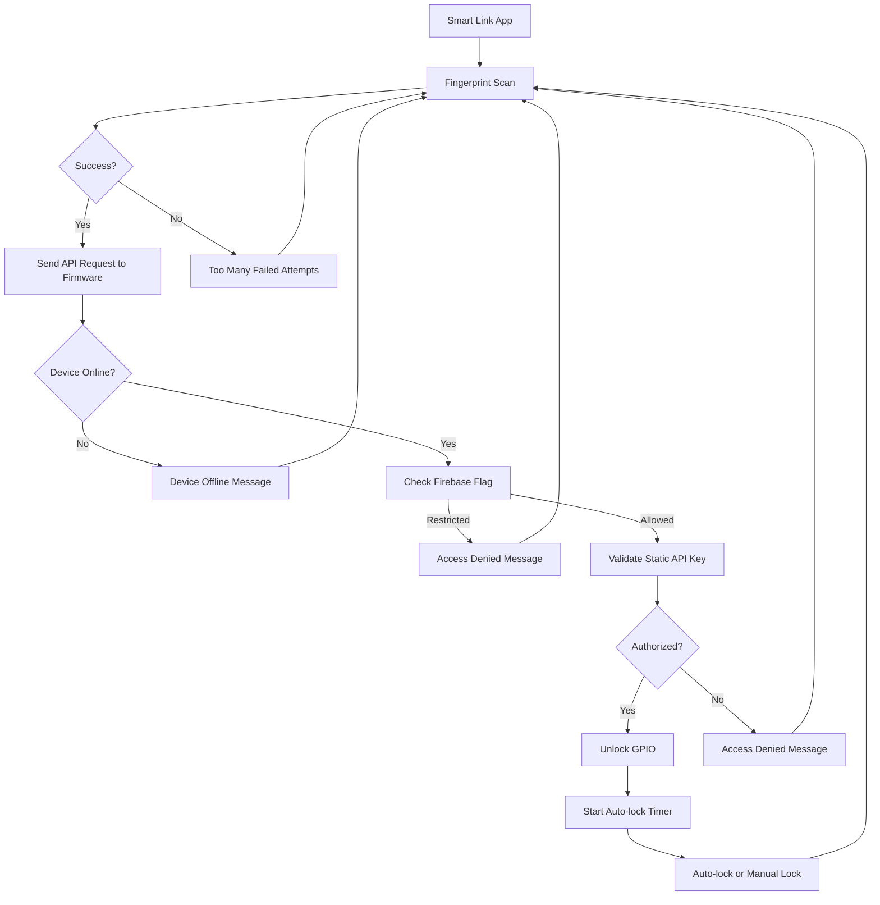

# Multi Smart Safe Locker System


> The Multi Smart Safe Locker System is a modular, decentralized locker solution powered by ESP32 microcontrollers. Each ESP32 controls up to 10 lockers, operates independently, and supports local admin control, user management, and remote
> firmware updates.
>
> Users unlock lockers via the [Smart Link](https://github.com/mediocre9/smart-link) mobile app using fingerprint authentication and Gmail login, while devices enforce access using static API keys and real-time Firebase-based revocation checks.
>
> The system runs in dual-mode (STA + AP), allowing simultaneous internet connectivity and local access for pairing. Firmware updates are handled through [Voyager OTA](https://www.voyagerota.com), a custom Remote OTA platform offering project-based release management with staging/production support.

---

## Table of Contents

1. [Features](#features)
2. [System Architecture](#system-architecture)
3. [System Responses](#system-responses)
4. [Setup Guide](#setup-guide)
5. [Usage Instructions](#usage-instructions)
6. [Admin Panel Screenshots](#admin-panel-screenshots)
7. [Libraries Used](#libraries-used)
8. [Scenario Breakdown](#scenario-breakdown)

---

## Features

-   [x] Web admin interface for WiFi and user management
-   [x] Static API key-based access control
-   [x] Operated by Smart-Link mobile app
-   [x] Individual-based auto-lock configuration
-   [x] Firmware revocation support
-   [x] Remote OTA updates via Voyager OTA platform
-   [x] Real-time WebSocket timeout updates - **(Experimental)**

> [!WARNING]
> Real-time Websocket updates are currently behind an `EXPERIMENTAL_FEATURE` flag.

---

## System Architecture

### Admin Interface



### Unlock Flow



---

## System Responses

| Type                         | Code | Message                                                                                   |
| ---------------------------- | ---- | ----------------------------------------------------------------------------------------- |
| Locker Unlocked              | 200  | `Locker (GPIO number) has been unlocked.`                                                 |
| WebSocket Exists             | 409  | `WebSocket already established.`                                                          |
| Access Denied                | 403  | `Access denied.`                                                                          |
| Firmware Restricted          | 403  | `Locker access restricted.`                                                               |
| Network Error                | 403  | `Connection failed. Check network settings.`                                              |
| Internet Network Error       | 403  | `Unable to connect. Please contact the admin to configure the system's network settings.` |
| Api Key Allowed Content-Type | 401  | `Allowed Content-Type is text/plain`                                                      |
| Api Key Not Found            | 400  | `API-Key was not provided!`                                                               |
| Invalid API Key              | 401  | `Invalid API-Key.`                                                                        |

---

## Setup Guide

### Firebase Setup

```cpp
#define FIREBASE_WEB_API_KEY "<your-api-key>"
#define FIREBASE_RTDB_REFERENCE_URL "<your-rtdb-url>"
```

> [!WARNING]
> Do not expose Firebase credentials publicly.

### Initial Boot

1. Set `REGISTER_ESP_ON_FIREBASE` to `true`
2. Flash the firmware
3. Reset flag to `false` after first boot

### Web Interface Files

1. Install [arduino-littlefs-upload](https://github.com/earlephilhower/arduino-littlefs-upload)
2. Place web files in `/data`
3. Upload with LittleFS plugin

> [!TIP]
> Make sure you install the correct LittleFS plugin for your environment.

---

## Usage Instructions

### Admin Access

1. Connect to ESP32 Wi-Fi
2. Visit `http://192.168.4.1`
3. Configure SSID, password, and authorized users

### Unlock Flow

1. Install [Smart Link](https://github.com/mediocre9/smart-link)
2. Sign in with Google
3. Scan fingerprint and request unlock
4. Firmware validates API key and revocation status of firmware on Firebase

> [!IMPORTANT]
> The Smart Link app connects to ESP32 via AP mode, but the device must have STA internet for Revocation Status.

---

## Admin Panel Screenshots


---

## Libraries Used

-   [Firebase ESP Client](https://github.com/mobizt/Firebase-ESP-Client)
-   [ESPAsyncWebServer](https://github.com/me-no-dev/ESPAsyncWebServer)
-   [LittleFS](https://github.com/earlephilhower/arduino-esp8266littlefs-plugin)
-   [UUID](https://github.com/RobTillaart/UUID)

> [!TIP]
> Voyager OTA SDK and integration docs: [voyagerota.com/api/v1/docs](https://www.voyagerota.com/api/v1/docs)

## Scenario Breakdown

### 1. Basic Concept

Each smart locker cupboard uses **one ESP32 device** which controls up to **10 lockers**. Every ESP32 unit is self-contained and **does not communicate** with others. Even inside the same organization, lockers are isolated.

> [!NOTE]
> All locker data (user assignments, states) is stored **locally** on each ESP32.

---

### 2. Core Components

-   **Firmware (ESP32):** Controls locker logic, user assignments, access validation, and firmware updates
-   **Admin Dashboard:** Web UI at `http://192.168.4.1` to configure Wi-Fi, manage users, and check updates
-   **Smart Link App:** User-facing app with fingerprint auth and Gmail-based identity
-   **Firebase:** Only used by the firmware for device revocation check
-   **Voyager OTA:** Platform for remote firmware updates

---

### 3. Admin Controls

-   Add/remove users via Gmail from the local dashboard
-   Assignment is stored on-device
-   Admin access does **not require** internet

> [!IMPORTANT]
> Removing a user instantly disables their access to that locker

---

### 4. Developer Controls

-   **Firmware Revocation:**

    -   If Firebase blocks a device, firmware stops unlocking lockers
    -   Admin dashboard still works

-   **App User Block:**
    Developers can block Gmail IDs from using the Smart Link app

---

### 5. Internet Requirement (for Firmware Validation)

ESP32 **needs internet** to poll the revocation status on Firebase.

> [!WARNING]
> If ESP32 can't reach Firebase, **locker won't open** even if the user is locally authorized.

-   App will notify users of network issue
-   Admins can still manage the device locally (assign, remove users)

---

### 6. Firmware Updates

-   Admin can check for updates at `192.168.4.1`
-   If update exists, a changelog is shown
-   Admin can download and apply updates from dashboard

---

### 7. Voyager OTA Platform

-   Custom OTA platform for ESP32/ESP8266 devices
-   Uses semantic version diffing and lightweight C++ SDK
-   Enables easy, remote firmware update management

---

### 8. Example Flow: End-User at Organization A

-   Org A has 2 cupboards, each with 5 lockers and one ESP32
-   Admin connects to ESP32 via `192.168.4.1`, sets up internet and assigns Gmail to lockers
-   user signs into the Smart Link app with Gmail
-   She connects to ESP32’s Wi-Fi and requests unlock
-   If device passes Firebase check, locker opens
-   If no internet or revoked, locker remains locked and user gets notified

---

### 9. Visiting Another Organization

-   user goes to Org B with a similar setup
-   She gives Gmail to new admin
-   New admin assigns her to a locker on their ESP32
-   user connects to that ESP32 Wi-Fi

> [!Note]
> Devices **don’t share data**, so Org B’s ESP32 has **no idea** about user’s history with Org A

---

### 10. Summary

-   Every cupboard = one ESP32
-   Devices work independently
-   Admins assign users locally
-   Users unlock lockers using app + local Wi-Fi
-   Internet needed for Firebase revocation checks
-   Developers can revoke devices/users
-   Firmware updates via Voyager OTA

---
