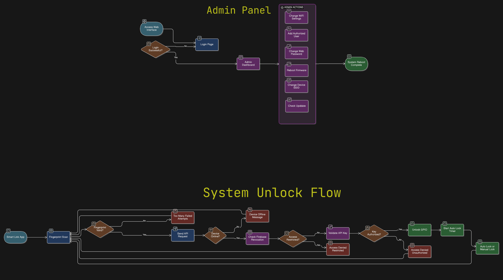
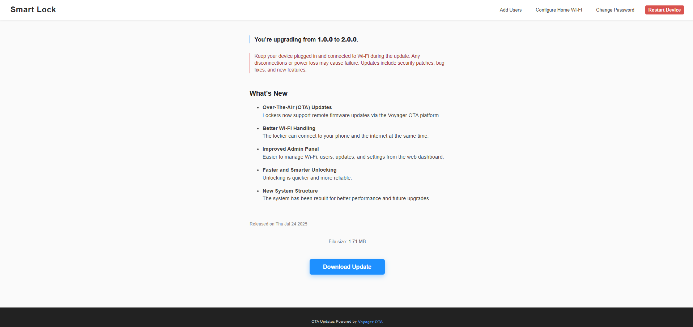

# Multi Smart Locker Firmware

> Modular ESP32 firmware for managing multiple lockers locally, with remote OTA updates and background firmware revocation checks. Each ESP32 manages up to 10 lockers independently, and users unlock only their assigned lockers via a single app, seamlessly across multiple locations without keys or shared credentials.

# Table of Contents

1. [Features](#1-features)
2. [System Architecture](#2-system-architecture)
3. [System Responses](#3-system-responses)
4. [Getting Started](#4-getting-started)
   1. [Firebase Setup](#41-firebase-setup)
   2. [VoyagerOTA Setup](#42-voyagerota-setup)
   3. [Initial Boot](#43-initial-boot)
   4. [Web Interface Files](#44-web-interface-files)
5. [Usage](#5-usage)
   1. [Admin Access](#51-admin-access)
   2. [Unlock Flow](#52-unlock-flow)
6. [Scenario Overview](#6-scenario-overview)
7. [Admin Panel Screenshots](#7-admin-panel-screenshots)
8. [Libraries Used](#8-libraries-used)
9. [License](#9-license)

---

## 1. Features

* [x] Controls up to 10 lockers per ESP32 device
* [x] Local dashboard for configuration, Wifi, and user management (offline admin support)
* [x] Firmware revocation checks via Firebase (background)
* [x] Smart-Link mobile app integration (fingerprint + Gmail login)
* [x] Static API key-based access control
* [x] Remote OTA updates through [`VoyagerOTA`](https://github.com/mediocre9/voyager-ota) platform
* [x] Per-locker auto-lock with WebSocket timeout updates (experimental)

> [!IMPORTANT]
> Real-time WebSocket updates are currently under an `EXPERIMENTAL_FEATURE` flag.

---

## 2. System Architecture

* **Single ESP32 per locker unit**: Each device manages up to 10 lockers independently. End users unlock lockers locally by connecting to the ESP32's Wifi hotspot.
* **Local Admin Interface**: Web dashboard at `http://192.168.4.1` to manage  Wifi, users, locker assignments, and firmware updates. **Admin must configure a home or organization  Wifi**; without it, locker operations are blocked because Firebase revocation checks require internet connectivity internally.
* **Unlock Flow**: Users authenticate via fingerprint in the Smart-Link app (enforced only at app level). After authentication, the app sends an unlock request to the ESP32, which validates API keys and operates lockers locally. Firebase revocation checks run silently in the background without impacting local unlocking.
* **Independent Deployment**: ESP32 units can be deployed across multiple locations. The same app works across deployments without sharing local locker data.



---

## 3. System Responses

| Type                         | Code | Message                                                                                 |
| ---------------------------- | ---- | --------------------------------------------------------------------------------------- |
| Locker Unlocked              | 200  | Locker (GPIO number) has been unlocked.                                                 |
| WebSocket Exists             | 409  | Websocket connection is already established!                                                        |
| Access Denied                | 403  | Access Denied. Please contact the admin to gain access.                                                                        |
| Firmware Restricted          | 403  | Locker access is restricted. Contact Developers for further details.                                                              |
| Network Error                | 403  | No internet connection available!                                             |
| Internet Network Error       | 403  | Unable to connect. Please contact the admin to configure the system's network settings. |

---

## 4. Getting Started

### 4.1 Firebase Setup

```cpp
#define FIREBASE_WEB_API_KEY "<your-api-key>"
#define FIREBASE_RTDB_REFERENCE_URL "<your-rtdb-url>"
```

### 4.2 VoyagerOTA Setup

1. Sign up on the VoyagerOTA platform and create a project.
2. Get your Project ID and API Key.
3. Install the official Client OTA library:

   * From [Github](https://github.com/mediocre9/VoyagerOTAClient)
   * Or via [Arduino IDE Library Manager](https://www.arduinolibraries.info/libraries/voyager-ota-client)
4. Configure your firmware: Open [`Config.hpp`](https://github.com/mediocre9/multi-smart-locker/blob/9be1e65998e2a7de73626670d82953bd6ef1bfd/includes/Config.hpp#L103-L104) and define Project ID and API Key.

> [!WARNING]
> Keep credentials safe. Store sensitive information in a gitignored `Secret.hpp` file.

> [!TIP]
> For custom OTA backends or GitHub release OTA, refer to the official [VoyagerOTAClient documentation](https://github.com/mediocre9/VoyagerOTAClient).

### 4.3 Initial Boot

1. Set `REGISTER_ESP_ON_FIREBASE` to true.
2. Flash the firmware.
3. Reset the flag to false after the first boot.

### 4.4 Web Interface Files

1. Install [`arduino-littlefs-upload`](https://github.com/earlephilhower/arduino-littlefs-upload) plugin
2. Place web files in `/data`.
3. Upload using the LittleFS plugin.

---

## 5. Usage

### 5.1 Admin Access

1. Connect to the ESP32 Wifi.
2. Open `http://192.168.4.1`.
3. Configure SSID, password, and assign Gmail users.
4. Admin can manage users locally; removing a user immediately revokes access.

### 5.2 Unlock Flow

1. Install the Smart Link app.
2. Sign in with Google.
3. Authenticate via fingerprint in the app.
4. The app sends an unlock request to the ESP32, which validates API keys locally.

> [!IMPORTANT]
>
> * The firmware requires an internet connection configured by the admin. Without it, even authorized users cannot unlock lockers. The device will notify users to contact the admin for internet setup.
> * If the firmware is revoked via Firebase, users will receive a message in the app indicating that the firmware is blocked. This action can only be performed by developers; admins cannot override it.
> * Users who are not assigned a locker or not authorized will receive an access denied message.
> * Users blocked at the app level (enforced by developers) cannot unlock lockers, even if assigned locally.

---

## 6. Scenario Overview

Each ESP32 operates independently. Users unlock lockers via the ESP32’s Wifi or access point using the Smart-Link app. The same app works across multiple locations without sharing local locker data.

* **Organization A**: Admin assigns User A to specific lockers; User A connects to the ESP32 Wifi and unlocks the assigned locker using the app. Lockers auto-lock or can be manually locked.
* **Organization B**: Another ESP32 unit controls lockers independently; User A is assigned a locker locally and unlocks it via the same app.

---

## 7. Admin Panel Screenshots




---

## 8. Libraries Used

* [VoyagerOTAClient](https://github.com/mediocre9/VoyagerOTAClient)
* [Firebase ESP Client](https://github.com/mobizt/Firebase-ESP-Client)
* [ESPAsyncWebServer](https://github.com/me-no-dev/ESPAsyncWebServer)
* [LittleFS](https://github.com/earlephilhower/arduino-esp8266littlefs-plugin)
* [UUID](https://github.com/RobTillaart/UUID)

---

## 9. License

This project is licensed under the MIT License. See the [LICENSE](https://github.com/mediocre9/multi-smart-locker/blob/main/LICENSE) for details.
